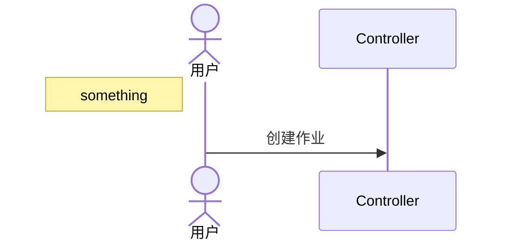
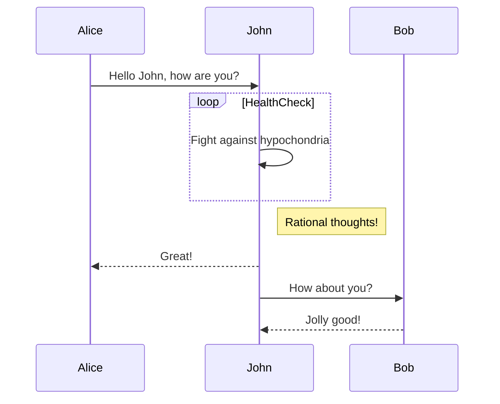
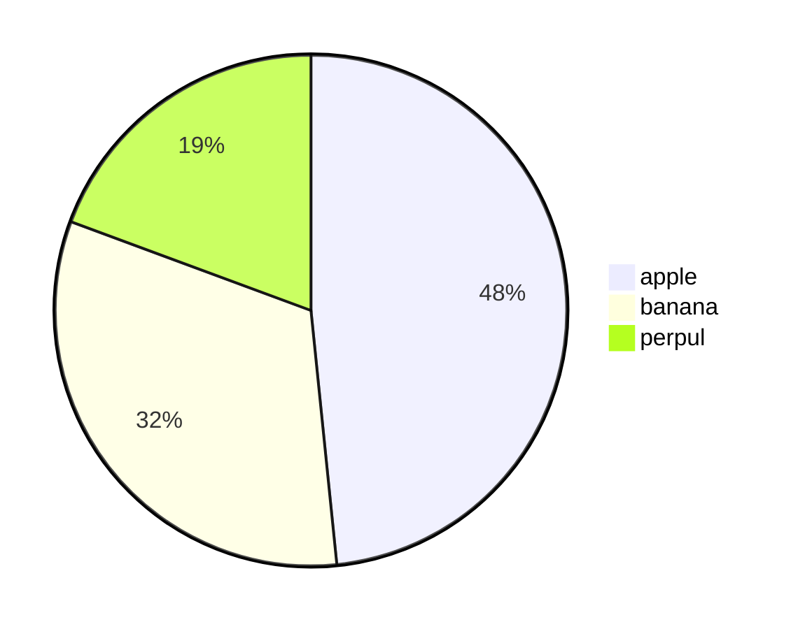

## 挂起pod对gang调度的影响

两种
方案一：不创建pod
方案二：创建pod，但不调度
方案一的优点：
1. 需要更新gang调度插件的逻辑，以适应因挂起而未创建pod的作业，需考虑job.ValidTaskNum + suspendPodNum >= MinAvailable，以及ReadyTaskNum + suspendPodNum >= MinAvailable以满足gang调度需求

|特性维度|	使用 SchedulingGates|	不创建 Pod|
|---|---|---|
|资源占用|	占用 API 资源|	零资源占用|
|调度延迟|	低（快速就绪）|	高（需重新创建）|
|状态管理|	状态完整可追溯|	无状态记录|
|依赖关系|	支持复杂依赖	|简单依赖|
|配额管理|	占用命名空间配额|	不占用配额|

