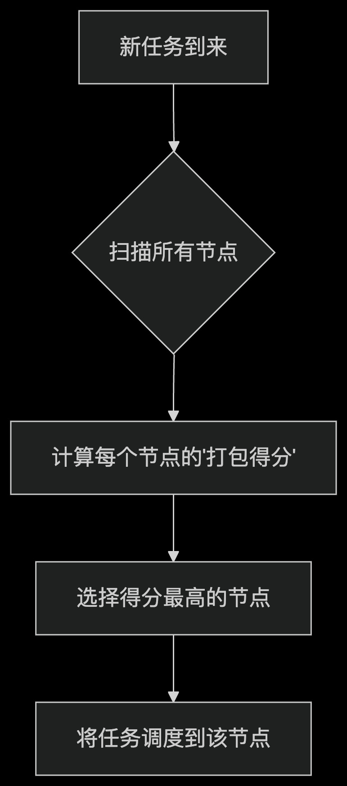

源代码位置 pkg/scheduler/plugins/binpack/binpack.go

## Volcano调度器的"Binpack"插件：让你的集群资源利用率飙升的智能打包术

在Kubernetes集群中，如何高效利用资源就像玩俄罗斯方块 - 你需要巧妙地将各种形状的方块（任务）紧密排列，避免空隙（资源碎片）。这就是Volcano调度器中**Binpack插件**的魔力所在！今天我们就来揭秘这个智能打包大师的源代码。

---

### 🌟 Binpack插件是什么？
Binpack插件是Volcano调度器的核心组件之一，它的核心使命是：**最大化集群资源利用率**。想象一下搬家公司装车的过程：
- 卡车：Kubernetes节点（Node）
- 货物：容器任务（Pod）
- 目标：用最少的卡车装最多的货物

Binpack插件就是那个经验丰富的装车师傅，它会把任务尽可能"打包"到少数节点上，让空闲节点可以关机省电或运行其他大型任务。

---

### 🔍 核心工作原理图解




---

### ⚙️ 核心代码解析

#### 1. **权重配置 - 指挥打包的蓝图**
```go
type priorityWeight struct {
    BinPackingWeight    int // 插件整体权重
    BinPackingCPU       int // CPU资源权重
    BinPackingMemory    int // 内存资源权重
    BinPackingResources map[v1.ResourceName]int // 自定义资源权重
}
```
这就像告诉装车师傅：
> "CPU空间最重要（权重5），内存次之（权重3），GPU资源也要考虑（权重2）"

实际配置示例：
```yaml
- name: binpack
  arguments:
    binpack.weight: 10       # 整体重要性
    binpack.cpu: 5           # CPU权重
    binpack.memory: 3        # 内存权重
    binpack.resources: nvidia.com/gpu  # 自定义资源
    binpack.resources.nvidia.com/gpu: 2 # GPU权重
```

#### 2. **打包算法 - 智能决策引擎**
核心计算逻辑在`BinPackingScore`函数中：
```go
func BinPackingScore(task *api.TaskInfo, node *api.NodeInfo, weight priorityWeight) float64 {
    score := 0.0
    for resource, weight := range weight.BinPackingResources {
        // 计算该资源在节点上的利用率
        resourceScore := (任务需求 + 节点已使用) * weight / 节点总量
        score += resourceScore
    }
    return score * 10 // 转换为0-100分
}
```

#### 3. **资源利用率计算 - 精确测量**
```go
func ResourceBinPackingScore(requested, capacity, used float64, weight int) float64 {
    // 计算节点装载该任务后的新利用率
    newUsage := (requested + used) / capacity
    return newUsage * float64(weight)
}
```
这相当于计算："如果把这件货物装上车，车厢空间利用率能达到多少？"

---

### 🚀 实际调度过程
当有新任务需要调度时：

1. **遍历所有节点**：检查每个节点的剩余空间
   ```go
   for _, node := range ssn.Nodes {
       score := BinPackingScore(task, node, weight)
   }
   ```

2. **计算打包得分**：考虑CPU、内存等资源的利用率
   ```go
   // 示例：节点资源情况
   节点总内存：64GB
   已使用内存：32GB
   任务需求：16GB
   内存利用率 = (32 + 16)/64 = 75%
   ```

3. **选择最佳节点**：优先选择利用率最高的节点
   ```go
   // 节点得分对比
   节点A得分：85（当前利用率70% + 任务后达85%）
   节点B得分：40（当前利用率20% + 任务后达40%）
   => 选择节点A！
   ```

4. **执行调度**：将任务绑定到得分最高的节点

---

### 💡 为什么Binpack如此重要？

#### ✅ **优势**
- **节能省钱**：密集打包后，空闲节点可关机
- **提升性能**：相关任务打包到同一节点，减少网络延迟
- **预留空间**：为大型任务保留完整节点资源

#### ⚠️ **注意事项**
1. **避免过度打包**：通过权重控制平衡
2. **热点监控**：配合监控防止单节点过载
3. **特殊资源**：GPU等稀缺资源需特殊权重配置

---

### 🛠️ 自定义你的打包策略
通过调整参数实现不同打包策略：

```yaml
# 策略1：CPU优先型（适合计算密集型）
binpack.cpu: 10
binpack.memory: 1

# 策略2：内存优先型（适合内存密集型）
binpack.cpu: 2
binpack.memory: 8

# 策略3：GPU密集型
binpack.resources.nvidia.com/gpu: 10
```

---

### 💻 开发者视角
1. **扩展性**：轻松添加对新资源的支持
   ```go
   // 添加SSD存储资源
   binpack.resources: example.com/ssd
   binpack.resources.example.com/ssd: 5
   ```

2. **调试技巧**：开启详细日志
   ```go
   klog.V(4).Infof("Binpack score: %v", score)
   ```
   通过日志级别查看详细计算过程

3. **性能优化**：避免不必要计算
   ```go
   if weight == 0 { 
       return 0 // 跳过权重为0的资源
   }
   ```

---

### 🌈 总结
Volcano的Binpack插件就像一位智能的仓库管理员：
1. **精确测量**：实时计算节点资源利用率
2. **智能决策**：选择最佳"打包位置"
3. **灵活定制**：通过权重适应不同场景
4. **高效节能**：最大化集群资源利用率

通过理解Binpack插件的工作原理，你可以像搭积木大师一样，在Kubernetes集群中实现资源的完美拼图！