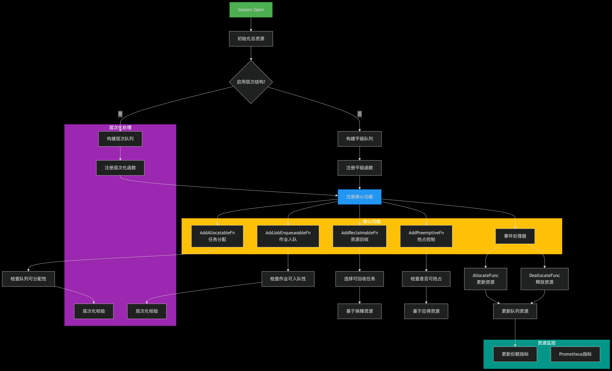

capacity.go

### 插件的作用
Capacity插件是Volcano调度器中的一个重要组件，它主要负责 ***队列级别的资源配额管理*** 功能。 

简单来说，Capacity插件允许为队列设置每一维度资源（如CPU、内存、GPU等）的具体容量值。这种设计使得资源分配更加直观和精确，特别适合需要精细控制各种资源类型的场景，如AI大模型训练中需要为不同GPU型号（如A100和V100）设置独立配额的情况。
### 插件的使用
`kubectl edit cm -n volcano-system volcano-scheduler-configmap`
```yaml
kind: ConfigMap
apiVersion: v1
metadata:
  name: volcano-scheduler-configmap
  namespace: volcano-system
data:
  volcano-scheduler.conf: |
    actions: "enqueue, allocate, backfill, reclaim" # add reclaim action.
    tiers:
    - plugins:
      - name: priority
      - name: gang
        enablePreemptable: false
      - name: conformance
    - plugins:
      - name: drf
        enablePreemptable: false
      - name: predicates
      - name: capacity # add this field and remove proportion plugin.
      - name: nodeorder
      - name: binpack
```
- 对队列配置抢占行动
- capacity在volcano v1.9.0中可用，与proportion不兼容
##### 配置队列的应得字段
```yaml
apiVersion: scheduling.volcano.sh/v1beta1
kind: Queue
metadata:
  name: queue1
spec:
  reclaimable: true
  deserved: # set the deserved field.
    cpu: 2
    memeory: 8Gi
```
- 为队列配置deserved资源上限

### 插件的配置 - pluginArguments参数配置
在Volcano的Capacity调度插件中，pluginArguments framework.Arguments用于配置插件的运行时行为。以下是Capacity插件支持的关键配置参数及其作用，结合社区文档和实践总结如下：

###### 1. 基础参数

- rootQueue
    - 作用：指定层级队列体系的根队列名称，用于构建队列的父子层级关系（如root或default）。若未设置，默认使用空字符串或"default"。
    - 示例：rootQueue: "root"。

- reclaimable

  - 作用：控制队列是否允许资源回收。当集群资源紧张时，超过deserved的队列资源会被逐步回收。
  - 默认值：true（允许回收）。
  - 示例：reclaimable: false（禁止回收）。

###### 2. 资源分配策略
- enableOveruse
  - 作用：是否允许队列临时超量使用资源（弹性共享）。启用后，空闲资源可被其他队列借用。
  - 默认值：true。
  - 示例：enableOveruse: false（禁用弹性共享）。

- enableHierarchy
    - 作用：是否启用层级队列支持。需配合rootQueue使用，实现父队列到子队列的资源继承。
    - 默认值：false（v1.9+版本默认支持）。

###### 3. 调试与日志

- logLevel

  - 作用：设置插件的日志级别（如debug、info、error），用于排查调度问题。
  - 示例：logLevel: "debug"。

- metricsEnabled
- 作用：是否启用调度指标采集，监控队列的资源分配与回收状态。
- 默认值：true。

###### 4. 高级控制

- reclaimInterval
    - 作用：资源回收的时间间隔（单位：秒），控制回收操作的频率。
    - 默认值：60（1分钟）。
    - 示例：reclaimInterval: 30（更频繁回收）。

- guaranteeThreshold

    - 作用：队列最低保障资源（guarantee）的触发阈值（百分比）。当集群资源利用率超过该值时，优先保障队列的guarantee资源。
    - 默认值：80（即80%）。

###### 5. 配置示例
在Volcano调度器的ConfigMap中，典型配置如下：
```yaml
apiVersion: v1
kind: ConfigMap
metadata:
    name: volcano-scheduler-configmap
data:
    volcano-scheduler.conf: |
        actions: "enqueue, allocate, backfill"
        tiers:
        - plugins:
            - name: capacity
              arguments:
              rootQueue: "root"
              reclaimable: true
              enableOveruse: true
              logLevel: "info"
              reclaimInterval: 30
```

### 代码解读
插件参数
```go
type capacityPlugin struct {
	rootQueue      string    
	totalResource  *api.Resource 
	totalGuarantee *api.Resource

	queueOpts map[api.QueueID]*queueAttr  // 每个队列的资源配置
	// Arguments given for the plugin
	pluginArguments framework.Arguments  
}

type queueAttr struct {
	queueID   api.QueueID
	name      string
	share     float64
	ancestors []api.QueueID
	children  map[api.QueueID]*queueAttr

	deserved  *api.Resource     // 来自Queue.spec.deserved
	allocated *api.Resource
	request   *api.Resource
	// elastic represents the sum of job's elastic resource, job's elastic = job.allocated - job.minAvailable
	elastic *api.Resource
	// inqueue represents the resource request of the inqueue job
	inqueue    *api.Resource
	capability *api.Resource
	// realCapability represents the resource limit of the queue, LessEqual capability
	realCapability *api.Resource
	guarantee      *api.Resource
}
```
Queue的定义
```go
type QueueSpec struct {
	Weight     int32
	Capability v1.ResourceList
	Reclaimable *bool
	// Guarantee indicate configuration about resource reservation
	Guarantee Guarantee `json:"guarantee,omitempty" protobuf:"bytes,4,opt,name=guarantee"`
	// The amount of resources configured by the user. This part of resource can be shared with other queues and reclaimed back.
	// +optional
	Deserved v1.ResourceList `json:"deserved,omitempty" protobuf:"bytes,9,opt,name=deserved"`
}
```
容量插件会关注队列的三个字段。 
- Capability：资源类型的配额上限。任何情况下，队列中任何资源类型的资源总量都不能超过此限制。 
- Guarantee：资源类型的配额下限。即使队列中没有作业，这部分资源也会被保留，不会借给其他队列。 
- Deserved：资源类型应得的配额。这部分资源允许共享给其他队列，并且可以回收。


以下是根据 Volcano Capacity 插件源代码的工作流程绘制的详细流程图，展示了该插件的核心工作机制：



### 流程详解：

#### 1. **初始化阶段**
```go
func OnSessionOpen(ssn *framework.Session) {
    cp.totalResource.Add(ssn.TotalResource) // 初始化集群总资源
    hierarchyEnabled := cp.HierarchyEnabled(ssn) // 检查是否启用层次结构
    if hierarchyEnabled {
        readyToSchedule = cp.buildHierarchicalQueueAttrs(ssn) // 构建层次队列
    } else {
        cp.buildQueueAttrs(ssn) // 构建平级队列
    }
    // ...注册功能函数...
}
```

#### 2. **核心功能注册**
插件注册五个核心功能函数：

| 功能函数 | 作用 | 关键逻辑 |
|---------|------|---------|
| **ReclaimableFn** | 资源回收 | 选择超过保障资源的任务进行回收 |
| **PreemptiveFn** | 抢占控制 | 检查抢占后是否超过应得资源 |
| **AllocatableFn** | 任务分配 | 层次化校验队列资源容量 |
| **JobEnqueueableFn** | 作业入队 | 检查作业是否可加入队列 |
| **EventHandler** | 资源追踪 | 更新资源分配/释放状态 |

#### 3. **层次化处理流程**
```go
func checkHierarchicalQueue(attr *queueAttr) error {
    // 1. 检查父队列能力≥子队列总和
    if parentCapability < childTotal {
        return error("父队列能力不足")
    }
    
    // 2. 检查保障资源一致性
    if parentGuarantee < childGuarantees {
        return error("父队列保障资源不足")
    }
    
    // 3. 递归检查子队列
    for _, child := range children {
        checkHierarchicalQueue(child)
    }
}
```

#### 4. **资源校验逻辑**
**任务分配校验：**
```go
func queueAllocatable(queue *api.QueueInfo, candidate *api.TaskInfo) bool {
    futureUsed := allocated + candidate资源
    return futureUsed ≤ realCapability // 不超过队列能力
}
```

**作业入队校验：**
```go
func jobEnqueueable(queue *api.QueueInfo, job *api.JobInfo) bool {
    required := minReq + allocated + inqueue - elastic
    return required ≤ realCapability // 不超过队列能力
}
```

#### 5. **资源监控指标**
插件实时更新Prometheus指标：
```go
metrics.UpdateQueueDeserved(...)    // 队列应得资源
metrics.UpdateQueueAllocated(...)   // 已分配资源
metrics.UpdateQueueRequest(...)     // 总请求资源
metrics.UpdateQueueShare(...)       // 资源使用率
```

#### 6. **事件驱动更新**
```go
AddEventHandler(&framework.EventHandler{
    AllocateFunc: func(event *framework.Event) {
        attr.allocated.Add(event.Task.Resreq) // 分配资源
        cp.updateShare(attr) // 更新份额
    },
    DeallocateFunc: func(event *framework.Event) {
        attr.allocated.Sub(event.Task.Resreq) // 释放资源
        cp.updateShare(attr) // 更新份额
    }
})
```

### 关键设计特点：
1. **双模式支持**：
  - 平级队列：所有队列独立管理
  - 层次队列：父子队列嵌套管理

2. **多层校验**：


3. **动态资源计算**：
   ```
   deserved = min(capability, max(guarantee, request))
   ```

4. **资源状态跟踪**：
  - 已分配(allocated)
  - 总请求(request)
  - 排队中(inqueue)
  - 可回收(elastic)

这个流程图完整展示了Capacity插件如何作为Volcano调度器的资源管家，实现从资源初始化、队列构建、功能注册到实时监控的全流程管理。