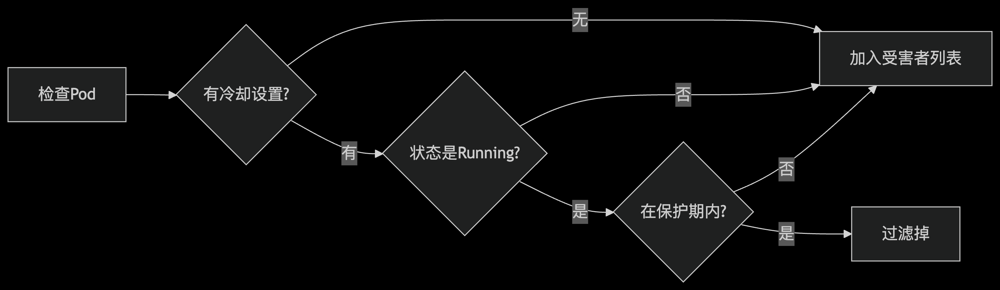

### 深入理解Volcano调度器中的CDP插件：保护Pod免受频繁抢占
#### 引言

CDP插件全称为"Cooldown Protection"(冷却保护)插件，它是Volcano调度器中的一个扩展功能，主要解决弹性训练或服务场景下Pod被频繁抢占的问题。
#### 问题背景
在弹性训练或服务场景中，可抢占的作业(Pod)可能会经历以下循环：

- 被抢占(Preempted)
- 恢复运行(Restored)
- 短暂运行后再次被抢占

如果没有冷却保护机制，这种循环可能导致：

- 服务稳定性下降
- 训练过程频繁中断
- 资源利用率低下

CDP插件正是为了解决这个问题而设计的，它确保Pod在冷却保护条件下不会被抢占。
#### CDP插件源码解析

插件定义与初始化
```go
const (
    // PluginName 定义了插件的名称为"cdp"
    PluginName = "cdp"
)

type CooldownProtectionPlugin struct {
    // 插件结构体，目前没有额外字段
}

// New 创建并返回一个新的CDP插件实例
func New(arguments framework.Arguments) framework.Plugin {
    return &CooldownProtectionPlugin{}
}

// Name 返回插件名称
func (*CooldownProtectionPlugin) Name() string {
    return PluginName
}
```
这部分代码定义了插件的基本结构：
- 定义了插件名称常量PluginName
- 创建了CooldownProtectionPlugin结构体
- 实现了New工厂函数和Name方法

##### 核心功能：podCooldownTime方法 
```go
func (sp *CooldownProtectionPlugin) podCooldownTime(pod *v1.Pod) (value time.Duration, enabled bool) {
    // 首先检查Pod的Labels中是否有CooldownTime设置
    v, ok := pod.Labels[v1beta1.CooldownTime]
    if !ok {
        // 如果Labels中没有，再检查Annotations
        v, ok = pod.Annotations[v1beta1.CooldownTime]
        if !ok {
            // 如果都没有，返回0和false表示不启用冷却保护
            return 0, false
        }
    }
	
    // 尝试解析时间持续时间字符串
    vi, err := time.ParseDuration(v)
    if err != nil {
        // 解析失败，记录警告日志并返回不启用
        klog.Warningf("invalid time duration %s=%s", v1beta1.CooldownTime, v)
        return 0, false
    }
    
    // 解析成功，返回冷却时间和启用状态
    return vi, true
}
```
这个方法负责从Pod的Labels或Annotations中获取冷却时间设置，并验证其有效性。它支持两种配置方式：

- 通过Pod的Labels设置v1beta1.CooldownTime
- 通过Pod的Annotations设置v1beta1.CooldownTime

##### 插件会话打开时的行为
```go
func (sp *CooldownProtectionPlugin) OnSessionOpen(ssn *framework.Session) {
    // 定义一个过滤受害者(Victim)的函数
    filterVictimFn := func(evictingTask *api.TaskInfo, candidateVictims []*api.TaskInfo) ([]*api.TaskInfo, int) {
        var victims []*api.TaskInfo
        // 遍历所有候选受害者
        for _, candidateVictim := range candidateVictims {
            // 获取该Pod的冷却时间设置
            cooldownTime, enabled := sp.podCooldownTime(candidateVictim.Pod)
            // 如果冷却保护未启用，直接加入受害者列表
            if !enabled {
                victims = append(victims, candidateVictim)
                continue
            }
            pod := candidateVictim.Pod
            // 检查Pod是否处于Running状态且有稳定的调度条件
            stableFiltered := false
            if pod.Status.Phase == v1.PodRunning {
                // 检查Pod是否有PodScheduled条件且状态为True
                for _, c := range pod.Status.Conditions {
                    if c.Type == v1.PodScheduled && c.Status == v1.ConditionTrue {
                        // 计算Pod稳定运行的时间点
                        // 如果当前时间还未超过冷却时间，则过滤掉该Pod(不抢占)
                        if c.LastTransitionTime.Add(cooldownTime).After(time.Now()) {
                            stableFiltered = true
                        }
                        break
                    }
                }
            }
            
            // 如果Pod不满足稳定运行条件，则加入受害者列表
            if !stableFiltered {
                victims = append(victims, candidateVictim)
            }
        }
        // 记录日志
        klog.V(4).Infof("Victims from cdp plugins are %+v", victims)
        // 返回受害者列表和许可状态
        return victims, util.Permit
    }

    // 记录插件会话打开日志
    klog.V(4).Info("plugin cdp session open")
    
    // 将过滤函数注册到调度会话中
    // 对于抢占(Preemptable)和回收(Reclaimable)场景都应用此过滤
    ssn.AddPreemptableFn(sp.Name(), filterVictimFn)
    ssn.AddReclaimableFn(sp.Name(), filterVictimFn)
}
```
这是CDP插件的核心逻辑，它在调度会话打开时注册了一个过滤函数filterVictimFn，该函数会在以下两种场景被调用：

- 抢占场景(Preemptable): 当需要抢占其他Pod的资源时
- 回收场景(Reclaimable): 当需要回收资源时
- 第一个返回值victims：这是经过CDP插件过滤后确定的受害者Pod列表
- 第二个返回值：util.Permit 类型int，含义：这是一个决策状态码，表示过滤函数的决策结果

1）对于每个候选受害者Pod，检查其冷却时间设置  
2）如果冷却保护未启用，直接允许抢占/回收  
3）如果Pod处于Running状态且有稳定的调度条件(PodScheduled为True)，则检查其稳定运行时间   
4）如果当前时间还未超过冷却时间，则过滤掉该Pod(不允许抢占/回收)    
5）其他情况(非Running状态或没有稳定条件)则允许抢占/回收  

##### 插件会话关闭
```go
func (*CooldownProtectionPlugin) OnSessionClose(ssn *framework.Session) {}
```
这个方法目前是空的，表示在调度会话关闭时不需要执行任何特殊操作。

CDP插件的工作流程
让我们用一个简单的流程图来理解CDP插件的工作流程：



#### 实际应用场景
假设我们有一个弹性训练作业，配置了如下冷却时间：
```yaml
apiVersion: batch.volcano.sh/v1alpha1
kind: Job
metadata:
  name: elastic-training
spec:
  minAvailable: 2
  schedulerName: volcano
  plugins:
    cdp: []
  tasks:
  - name: training
    replicas: 4
    template:
      metadata:
        annotations:
          cooldown-time.volcano.sh: "5m"  # 设置5分钟冷却时间
      spec:
        containers:
        - image: tensorflow/tensorflow
          name: tensorflow
        restartPolicy: OnFailure
```
在这个例子中：

- 每个Pod都有一个5分钟的冷却时间设置
- 当调度器需要抢占资源时，会检查每个候选Pod的冷却状态
- 如果一个Pod刚刚从被抢占状态恢复运行，且运行时间不足5分钟，则不会被再次抢占
- 只有当Pod稳定运行超过5分钟后，才可能被再次抢占

### 总结
CDP插件是Volcano调度器中一个非常有用的功能，它通过引入冷却时间机制，有效防止了弹性作业Pod被频繁抢占的问题，提高了服务的稳定性和训练过程的连续性。
对于需要高可用性和稳定性的弹性工作负载，如机器学习训练、实时服务等，启用CDP插件可以显著改善用户体验和系统可靠性。